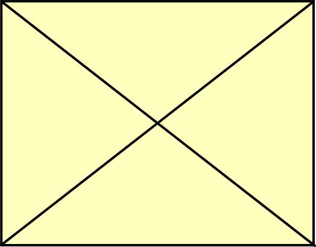

A short introdution to formatting slides for our classroom presentations. For more in-depth information, see the [Pandoc User's Guide](https://pandoc.org/MANUAL.html).

The source code for this presentation is available at <https://github.com/strykeforce/classroom>

## Structuring the Slide Show

::: {.columns}
::: {.column width=40%}

- Level 1 and 2 headings create a new slide
- Level 3 and higher create headings within a slide
- A horizontal rule always starts a new slide. (`---`)

:::
::: {.column width=60%}

```markdown
# Level One

<!-- good for a section break -->

## Level Two

This is on a new slide.

### Level Three

Sub-heading on "Level Two" slide.

---

A new slide after "Level Two" slide.
```

:::
:::

## Code Blocks

These start and end with three backticks (` ` `), no indentation is neccessary. Include the name of the language for highlighing.

---

Typing this:

````markdown
```java
class HelloWorld {
    public static void main(String[] args) {
        System.out.println("Hello, World!");
    }
}
```
````

Produces this:

```java
class HelloWorld {
    public static void main(String[] args) {
        System.out.println("Hello, World!");
    }
}
```

## Lists

A bullet list is a list of bulleted list items. A bulleted list item begins with a bullet (\*, +, or -).

Ordered lists work just like bulleted lists, except that the items begin with numbers rather than bullets.

List items may include other lists. The nested list must be indented to line up with the first character above.

---

Typing this:

```markdown
- fruits
  - apples
  - oranges
- vegetable
  - broccoli
```

Produces this:

- fruit
  - apples
  - oranges
- vegetable
  - broccoli

---

Typing this:

```markdown
1. step one
   1. sub-step
2. step two
```

Produces this:

1. step one
   1. sub-step
2. step two

## Images


