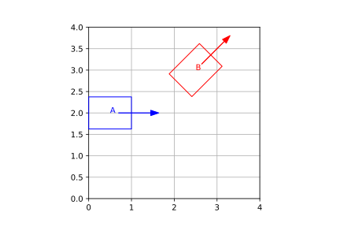

# The End {data-background-color="rgb(241, 186, 27)"}

{style="width: 50%; margin-top:50px; box-shadow: 7px 7px 7px rgba(0, 0, 0, 0.4);"}\

::: notes

Trivia: Mark quoted from this cartoon after seeing the first trajectory following demo in 2018.

:::

# Appendix{data-background-color="rgb(241, 186, 27)"}

# PathWeaver Deep Dive{data-background-color="rgb(241, 186, 27)"}

An exploration of how PathWeaver interfaces with WPILIB Trajectory classes.

## PathWeaver Path

We can use PathWeaver to create a trajectory for the robot to drive.

\

\

## PathWeaver Path

PathwWaver internally represents this path as a list of **waypoints**.

\

|   X |   Y | Tangent X | Tangent Y | Fixed Theta | Reversed | Name            |
| --: | --: | --------: | --------: | :---------: | :------: | :-------------- |
|   0 |  -2 |         1 |         0 |    true     |  false   | start           |
|   1 |  -1 |         1 |         0 |    false    |  false   | top internal    |
|   2 |  -3 |         1 |         0 |    false    |  false   | bottom internal |
|   3 |  -2 |         1 |         0 |    true     |  false   | end             |

\

They are saved as CSV-formatted data in `*.path` files in a PathWeaver project.

## PathWeaver Waypoints

The important parts of a waypoint are its coordinates and the length and direction of its **tangent vector**. We denote the tangent vector with its tail at the waypoint coordinates and its head at tangent x, y.

\

## Waypoint to Trajectory Conversion

This [code excerpt](https://github.com/wpilibsuite/PathWeaver/blob/5e8ea0cafca829eeb10aa55ba70542022b6102da/src/main/java/edu/wpi/first/pathweaver/spline/wpilib/WpilibSpline.java#L172) from PathWeaver illustrates how it converts a list of waypoints to a trajectory.

```java
private static Trajectory trajectoryFromWaypoints(Iterable<Waypoint> waypoints, TrajectoryConfig config) {
    var list = new TrajectoryGenerator.ControlVectorList();
    for(Waypoint wp: waypoints) {
        list.add(new Spline.ControlVector(
                new double[] {wp.getX(), wp.getTangentX(), 0},
                new double[] {wp.getY(), wp.getTangentY(), 0}));
    }

    return TrajectoryGenerator.generateTrajectory(list, config);
}
```

### But what's really happening?

## Trajectories are Connected Splines

A trajectory is made up of one or more connected **splines**, each defined by end points and the slope at the end points. The end points of each spline are given by two consecutive waypoints from PathWeaver.

{width=100%}\

---

You can connect together as many splines as you need to complete a trajectory.

Here we show the three splines generated from the four PathWeaver waypoints in our earlier example.

{width=100%}\

::: notes
N waypoints will product N-1 splines.
:::

## Spline Parameterization

The [`SplineParameterizer`](https://first.wpi.edu/wpilib/allwpilib/docs/release/java/edu/wpi/first/wpilibj/spline/SplineParameterizer.html) ([source](https://github.com/wpilibsuite/allwpilib/blob/948625de9d40068133adf9b39310055e6521b9c0/wpimath/src/main/java/edu/wpi/first/wpilibj/spline/SplineParameterizer.java)) class breaks up the spline into various arcs until their dx, dy, and dθ are within specific tolerances.

Each dot on the right plot is a [`PoseWithCurvature`](https://first.wpi.edu/wpilib/allwpilib/docs/release/java/edu/wpi/first/wpilibj/spline/PoseWithCurvature.html).

{width=100%}\

::: notes
This works by checking the whole spline dx, dy and dθ, and then "recursively" splitting spline in half, rechecking each until limits are met.

velocities are planned for these points and constant acceleration/deceleration is assumed between them.
:::

---

We calculate the points for each spline and then append them together to produce the `PoseWithCurvature` points for the entire trajectory.

{width=100%}\

At this point, spline parameterization has given us the **x, y** coordinates and the **direction** of travel ([`Pose2d`](https://first.wpi.edu/wpilib/allwpilib/docs/release/java/edu/wpi/first/wpilibj/geometry/Pose2d.html)) for each trajectory point.

## Trajectory Parameterization

After spline parameterization has broken up our trajectory into manageable segments, we next need to calculate the velocity profile.

The velocity profile is, for each trajectory point, the **time** that point is reached, and the **velocity** and **acceleration** at that point. This calculation is called trajectory parameterization.

This is calculated by the [`TrajectoryParameterizer`](https://first.wpi.edu/wpilib/allwpilib/docs/release/java/edu/wpi/first/wpilibj/trajectory/TrajectoryParameterizer.html) class.

\

When you combine this with the **position** and **travel direction** of each trajectory point given by spline parameterization, we have all the information we need for the robot to drive the trajectory. (Spline parameterization also give us **curvature** at each trajectory point.)

---

The `TrajectoryParameterizer` class calculates the final trajectory points.

\

1. The distance between trajectory point B and the previous point A is calculated.
2. The velocity at B is calculated from the velocity at A, the maximum acceleration, and the distance travelled. $v_B = \sqrt{v_A^2 +2ad}$

   Clamp this to the maximum velocity if neccessary.

3. Apply trajectory constraints to maximum acceleration and velocity at point B.
4. Calculate the actual acceleration from the velocity at A, the constrained velocity at B, and the distance travelled. $a = \frac{v_B^2 - v_A^2}{2d}$

5. If actual acceleration exceeds the constrained acceleration for B, assign B's constrained acceleration to A and loop back to start again.
6. If actual acceleration is less than constrained acceleration for B, we are done! Go to next point and repeat.
7. When finished in the forward direction, go through this same entire process backwards through the list of points to make sure we don't exceed maximum decceleration.

::: notes

- We may need to iterate to find the maximum end velocity and common acceleration, since acceleration limits may be a function of velocity.
- Enforce global max velocity and max reachable velocity by global acceleration limit.
- If the actual acceleration for this state is higher than the max acceleration that we applied, then we need to reduce the max acceleration of the predecessor and try again.
- If the actual acceleration is less than the predecessor's min acceleration, it will be repaired in the backward pass.

:::

## Parameterized Trajectory with Centripetal Constraint

{width=100%}

::: notes

- we start accelerating at our max acceleration until centripetal acceleration constraints apply.
- trajectory is the same going forward as backwards.

:::

## Curvature

A quick detour into terminology — what is curvature?

{width=70%}\

Curvature is primarily uses to **constrain** our trajectory velocity and acceleration profile as needed, for example to prevent the robot from tipping in a tight turn.

::: notes

Intuitively, the curvature describes for any part of a curve how much the curve direction changes over a small distance travelled, so it is a measure of the instantaneous rate of change of direction of a point that moves on the curve: the larger the curvature, the larger this rate of change.
[Wikipedia](https://en.wikipedia.org/wiki/Curvature)

:::

# Geometry{data-background-color="rgb(241, 186, 27)"}

This section covers the geometry classes of WPILib.

## Field Coordinate System

The field coordinate system (or global coordinate system) is an absolute coordinate system where a point on the field is designated as the origin. Positive θ (theta) is in the counter-clockwise direction, and the positive x-axis points away from your alliance’s driver station wall, and the positive y-axis is perpendicular and to the left of the positive x-axis.

{width=75%}\

**Note:** The axes are shown at the middle of the field for visibility. The origins of the coordinate system for each alliance are shown next.

## Field Coordinate System Origin

Below is an example of a field coordinate system overlayed on the 2020 FRC field. The red axes shown are for the red alliance, and the blue axes shown are for the blue alliance.

\

## Robot Coordinate System

The robot coordinate system (or local coordinate system) is a relative coordinate system where the robot is the origin. The direction the robot is facing is the positive x axis, and the positive y axis is perpendicular, to the left of the robot. Positive θ is counter-clockwise.

{width=75%}\

**Note:** WPILib’s `Gyro` class is clockwise-positive, so you have to invert the reading in order to get the rotation with either coordinate system.

## Translation

Translation in 2 dimensions is represented by WPILib’s [`Translation2d`](https://first.wpi.edu/wpilib/allwpilib/docs/release/java/edu/wpi/first/wpilibj/geometry/Translation2d.html) class. This class has an x and y component, representing the point (x, y).

```java
var pointA = Translation2d(1, 1);
var pointB = Translation2d(3, 1);

System.out.println(pointA.getDistance(pointB)); // 2.0

// vector math
System.out.println(pointB.times(2)) // Translation2d(X: 6.00, Y: 2.00)
System.out.println(pointA.div(2)) // Translation2d(X: 0.50, Y: 0.50)
System.out.println(pointB.unaryMinus()) // Translation2d(X: -3.00, Y: -1.00)

System.out.println(pointA.plus(pointB)); // Translation2d(X: 4.00, Y: 2.00)
System.out.println(pointB.minus(pointA)); // Translation2d(X: 2.00, Y: 0.00)

System.out.println(pointA.rotateBy(Rotation2d.fromDegrees(-45))) // Translation2d(X: 1.41, Y: 0.00)
```

## Rotation

Rotation in 2 dimensions is representated by WPILib’s [`Rotation2d`](https://first.wpi.edu/wpilib/allwpilib/docs/release/java/edu/wpi/first/wpilibj/geometry/Rotation2d.html) class. This class has an angle component, which represents the robot’s rotation relative to an axis on a 2-dimensional coordinate system. Positive rotations are counterclockwise.

```java
Rotation2d angleA = Rotation2d.fromDegrees(45);
Rotation2d angleB = Rotation2d.fromDegrees(10);

System.out.println(angleA.plus(angleB)); // Rotation2d(Rads: 0.96, Deg: 55.00)
System.out.println(angleA.rotateBy(angleB)); // Rotation2d(Rads: 0.96, Deg: 55.00)

System.out.println(angleA.minus(angleB)); // Rotation2d(Rads: 0.61, Deg: 35.00)
System.out.println(angleA.rotateBy(angleB.unaryMinus())); // Rotation2d(Rads: 0.61, Deg: 35.00)

System.out.println(angleA.unaryMinus()); // Rotation2d(Rads: -0.79, Deg: -45.00)
System.out.println(angleB.times(2)); // Rotation2d(Rads: 0.35, Deg: 20.00)
```

## Pose

Pose is a combination of both translation and rotation and is represented by the [`Pose2d`](https://first.wpi.edu/wpilib/allwpilib/docs/release/java/edu/wpi/first/wpilibj/geometry/Pose2d.html) class. It can be used to describe the pose of your robot in the field coordinate system, or the pose of objects, such as vision targets, relative to your robot in the robot coordinate system.

::: {.columns}
::: {.column width=35% }

\

\

      A = Pose2d(
        Translation2d(X: 0.50, Y: 2.00),
        Rotation2d(Rads: 0.00, Deg: 0.00)
      )

      transform = Transform2d(
        Translation2d(X: 2.00, Y: 1.00),
        Rotation2d(Rads: 0.79, Deg: 45.00)
      )

      B = Pose2d(
        Translation2d(X: 2.50, Y: 3.00),
        Rotation2d(Rads: 0.79, Deg: 45.00)
      )

:::
::: {.column width=65%}

{width=100%}\

:::
:::

# PathWeaver Trajectory JSON

PathWeaver exports built trajectories in this JSON format. These JSON files are deployed to the robot and loaded into a `Trajectory` at `robotInit()`.

```json
[
  {
    "time": 0.0,
    "velocity": 0.0,
    "acceleration": 2.0,
    "pose": {
      "translation": { "x": 1.0, "y": 6.21055 },
      "rotation": { "radians": 0.0 }
    },
    "curvature": 0.0
  },
  {
    "time": 0.1759540554030928,
    "velocity": 0.3519081108061856,
    "acceleration": 1.9999999999999987,
    "pose": {
      "translation": { "x": 1.0309589505195618, "y": 6.2103166925191875 },
      "rotation": { "radians": -0.02267479979731116 }
    },
    "curvature": -1.4861117623228608
  }
]
```

Each of the JSON objects represents a `Trajectory.State` object.
