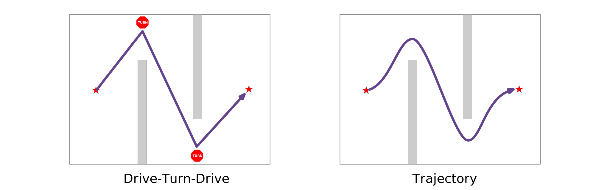
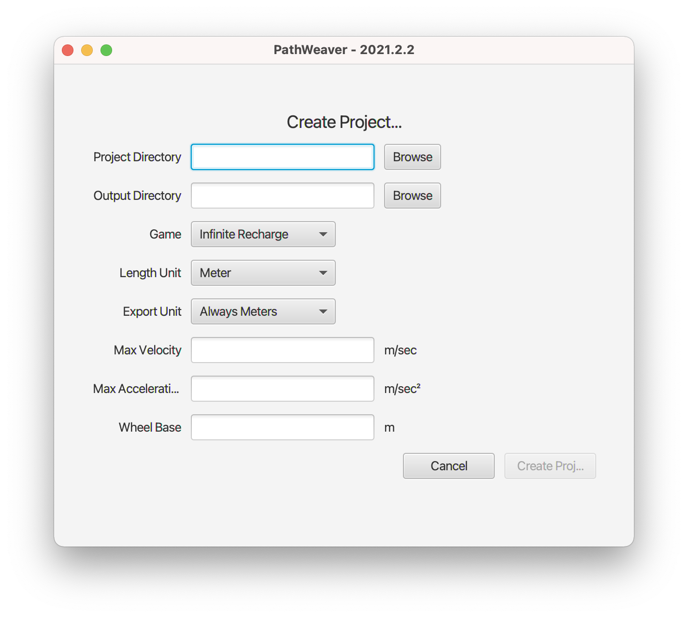
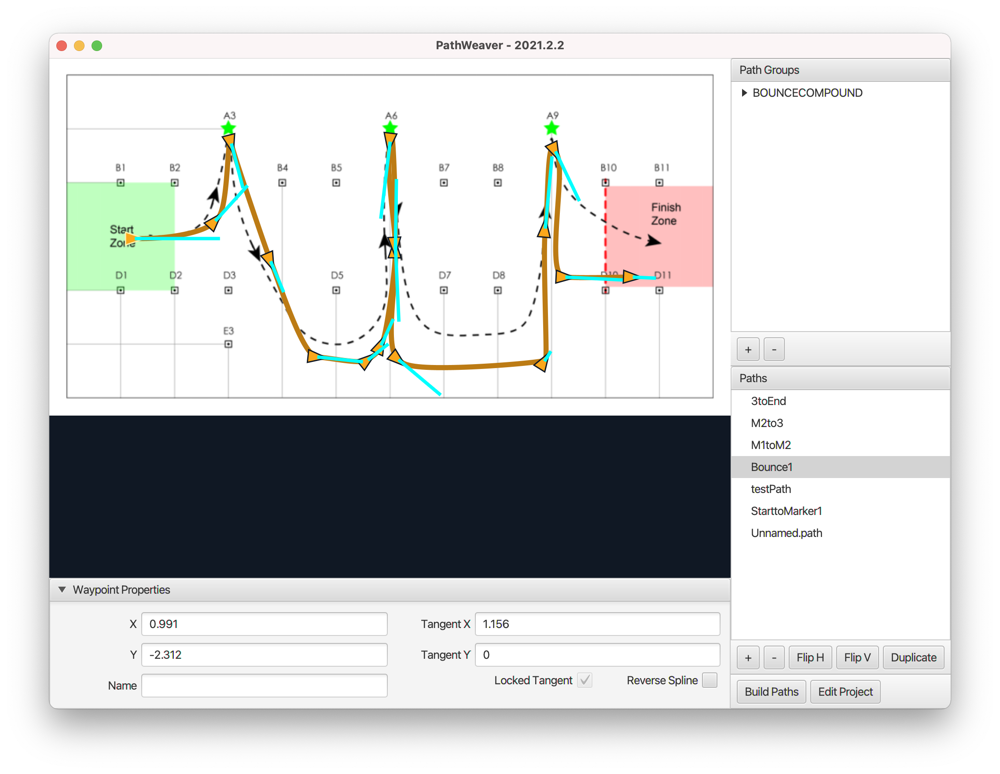
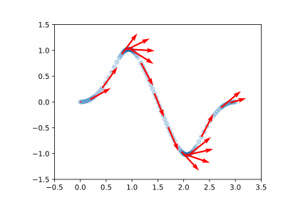
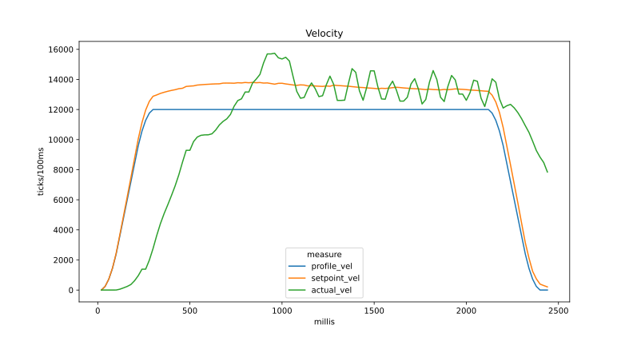
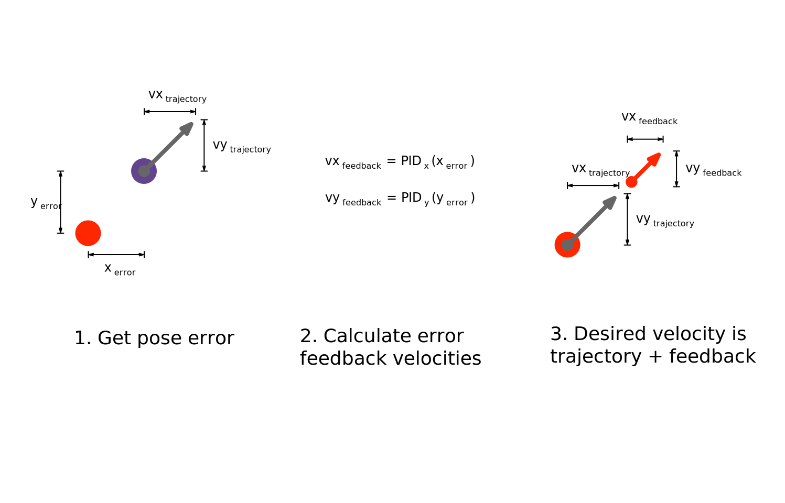
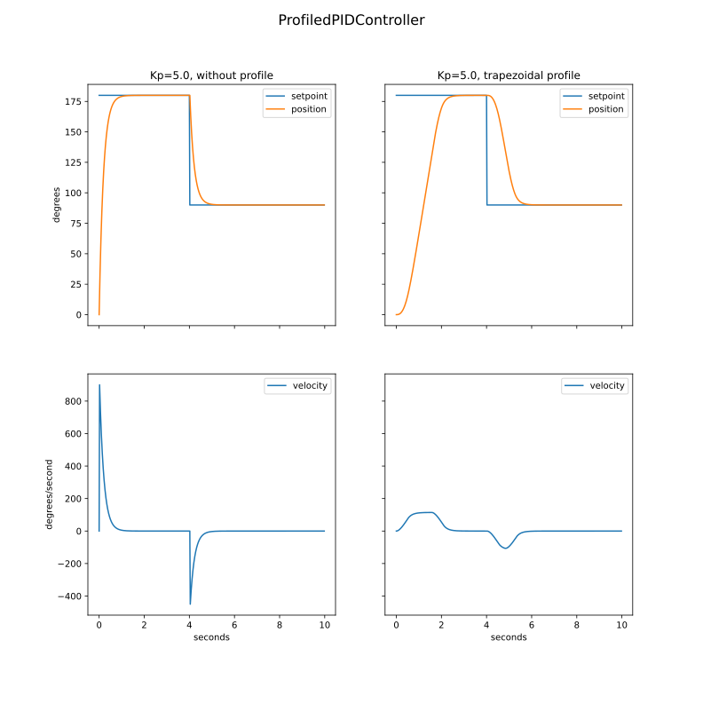

# Trajectory Following{data-background-color="rgb(241, 186, 27)"}

Getting the robot from point A to point B autonomously.

## Why Trajectory Following?

FRC® games often feature autonomous tasks that require a robot to effectively and accurately move from a known starting location to a known scoring location.

During the 2018 season, Stryke Force changed from the "drive-turn-drive" method to trajectory following.

\

While more technically challenging, trajectories can be driven much faster since we don't have to stop to change direction.

## Terminology

JSON

: Used for PathWeaver [trajectory export](#pathweaver-trajectory-json), JavaScript Object Notation, is an open standard file format, and data interchange format, that uses human-readable text to store and transmit data objects.

Pose

: A robot's pose is the combination of it's X, Y, and angle (θ) with respect to the field. See the [`Pose2d`](https://first.wpi.edu/wpilib/allwpilib/docs/release/java/edu/wpi/first/wpilibj/geometry/Pose2d.html) class.

Trajectory

: A trajectory contains of a collection of [`State`](https://first.wpi.edu/wpilib/allwpilib/docs/release/java/edu/wpi/first/wpilibj/trajectory/Trajectory.State.html) points that represent the pose, curvature, time elapsed, velocity, and acceleration at that point. See the [`Trajectory`](https://first.wpi.edu/wpilib/allwpilib/docs/release/java/edu/wpi/first/wpilibj/trajectory/Trajectory.html) class.

Waypoint

: Waypoints consists of a X, Y position on the field as well as a robot heading described by a tangent line.

::: notes

- Difference between pose and waypoint angle? Pose is robot yaw, waypoint is direction of travel.

:::

## Starting a PathWeaver Project

When starting a new PathWeaver project, we need to provide season-specific information.

{width=60%}\

Team up with a mentor to set this up for the first time in a season.

## Creating a Trajectory

The preferred way to create and visualize a path is with the PathWeaver tool.

\

## PathWeaver Tips and Tricks

- Adding additional waypoints and changing their tangent vectors can affect the path that is followed. Additional waypoints can be added by dragging in the middle of the path.
- Fewer is usually better when it comes to waypoints.
- It's sometimes hard to precisely set where the waypoints should be placed. In this case, setting the waypoint locations can be done by entering the X and Y value after selecting the waypoint.
- Path Groups are a way of visualizing where one path ends and the next one starts. By adding all the paths to a single path group and selecting the group, all paths in that group will be shown. Each path can be edited while viewing all the paths.

## Deploy PathWeaver JSON to Robot

Build all paths in the project by clicking the **Build Paths** button.

Configure PathWeaver to output JSON files in **`src/main/deploy/paths`**. Deploying robot code automatically places JSON files on the roboRIO file system in **`/home/lvuser/deploy/paths/output`**.

The PathWeaver JSON can be accessed using `getDeployDirectory`.

```java
String trajectoryJson = "paths/output/YourPath.wpilib.json";
Path trajectoryPath = Filesystem.getDeployDirectory().toPath().resolve(trajectoryJson);
Trajectory trajectory = TrajectoryUtil.fromPathweaverJson(trajectoryPath);
```

\

**Note:** Currently PathWeaver displays the [coordinate system](#coordinate-system) origin at the top left of the field. When building paths, PathWeaver sets the origin at the bottom left in order to be compatible with the [`Field2d`](https://first.wpi.edu/wpilib/allwpilib/docs/release/java/edu/wpi/first/wpilibj/smartdashboard/Field2d.html) view in the simulator GUI.

::: notes

Editing the initial waypoint of a path to have X=0.0 and Y=-8.21055 (~27 ft) will build the path with the initial state translation at X=0.0 and Y=0.0.

:::

## Robot Checklist

There are a few things the robot needs before we can actually drive a trajectory.

\

1. Swerve modules and motor controllers configured.
   - Motor controllers settings.
   - Azimuth motor closed-loop tuning.
   - Determine the maximum attainable speed for the robot.
   - Measure drive encoder "distance per pulse".
   - Physically set alignment (or zero) the azimuths.
2. Driver joystick inputs configured.
3. Finish setting up the swerve drive and verify teleop driving. See [`SwerveDriveKinematics`](#the-swervedrivekinematics-class).
4. Determine swerve module drive closed-loop velocity tuning.
5. Configure [`SwerveDriveOdometry`](#the-swervedriveodometry-class).
6. Configure the `HolonomicDriveController`. We'll see this in a later slide.

::: notes

Note that for the WPILib Encoder class, “pulse” refers to a full encoder cycle (i.e. four edges)

:::

## The HolonomicDriveController Class

The [`HolonomicDriveController`](https://first.wpi.edu/wpilib/allwpilib/docs/release/java/edu/wpi/first/wpilibj/controller/HolonomicDriveController.html) is used to follow trajectories using a _holonomic_ drive train, such as a swerve or mecanum drive.

The holonomic drive controller takes in one PID controller for each direction, forward and strafe, and one profiled PID controller for the yaw.

Because the yaw dynamics are decoupled from translations, we can can specify a custom yaw heading that the robot should point toward. This heading reference is profiled for smoothness to accomodate yaw setpoint changes.

```java
var xController = new PIDController(kPx, kIx, kDx);
var yController = new PIDController(kPy, kIy, kDy);
var thetaController = new ProfiledPIDController(kPt, kIt, kDt, constraints);
var holonomicDriveController = new HolonomicDriveController​(xController yController, thetaController);
```

---

Before we dive in to how the holonomic drive controller works, let take a look at a trajectory generated by PathWeaver. Below is a plot of the trajectory states with a some velocity vectors overlayed.

{width=75%}\

At its most basic, the job of the controller is to convert trajectory states to [`ChassisSpeeds`](#the-chassisspeeds-class), which we send to the swerve drive.

---

In a perfect world, the robot would exactly follow the desired trajectory. In the real world, physical effects such as intertia and friction create some error.

{width=80%}

::: notes

- kP looks OK since the setpoint velocity is stable.
- actual velocity is just wheel 0
- not sure what caused the actual velocity to fluctuate, drive velocity tuning?

:::

---

The holonomic drive controller compensates for this error accumulation by comparing the robot's **current pose** with the **desired trajectory state**.

The robot's current pose can be measured in real-time by using [`SwerveDriveOdometry`](#the-swervedriveodometry-class).

\

Let's take a look at the code for following a trajectory using a holonomic drive controller.

---

We will first reset our robot’s pose to the starting pose of the trajectory. This ensures that the robot’s location on the coordinate system and the trajectory’s starting position are the same.

```java
odometry.resetPose(trajectory.getInitialPose(), gyro.getRotation2d());
```

It is very important that the initial robot pose match the first pose in the trajectory. Typically this pose is an actual know or measured field position.

If we are using a trajectory that has been defined in robot-centric coordinates, we can first transform it to be relative to the robot’s current pose using the `Trajectory` [`transformBy`](<https://first.wpi.edu/wpilib/allwpilib/docs/release/java/edu/wpi/first/wpilibj/trajectory/Trajectory.html#transformBy(edu.wpi.first.wpilibj.geometry.Transform2d)>) method.

```java
Pose2d initial = trajectory.getInitialPose(); // (1)
Pose2d end = Constants.AUTON_START_POSE;
Transform2d transform = new Transform2d(initial, end);

trajectory = trajectory.transformBy(transform);
odometry.resetPose(trajectory.getInitialPose(), gyro.getRotation2d());
```

(1) Since we created a robot-relative trajectory, the initial pose will be x=0, y=0, θ=0

---

Assuming our trajectory is being used in a [`Command`](https://first.wpi.edu/wpilib/allwpilib/docs/release/java/edu/wpi/first/wpilibj2/command/Command.html), the following code gets executed periodically in the command's `execute()` method.

```java
double trajectoryElapsedTime = Timer.get() - trajectoryStartTime;
Trajectory.State state = trajectory.sample(trajectoryElapsedTime); // (1)

odometry.update(gyro.getRotation2d(), getModuleStates()); // (2)

ChassisSpeeds output = holonomicDriveController.calculate(odometry.getPoseMeters(), state, new Rotation2d()); // (3)

drive(output); // (4)
```

(1) Get the desired trajectory state for the current point in time.
(2) Update our measured position based on actual gyro reading and swerve module encoders.
(3) Calculate the desired **v**~x~, **v**~y~, and **ω** based on desired trajectory state, corrected for actual measured position.
(4) Send the desired speeds to swerve drive kinematics.

::: notes

- trajectory states are not evently spaced in time.
- the θ PID loop will keep the robot facing forward.

:::

## Holonomic drive controller error correction

The holonomic drive controller uses an X and Y [`PIDController`](https://first.wpi.edu/wpilib/allwpilib/docs/release/java/edu/wpi/first/wpilibj/controller/PIDController.html) to correct position errors while following a trajectory.

\

---

The holonomic drive controller uses a [`ProfiledPIDController`](https://first.wpi.edu/wpilib/allwpilib/docs/release/java/edu/wpi/first/wpilibj/controller/ProfiledPIDController.html) to allow us to smoothly change robot yaw while following a trajectory.

{size=100%}\

## Using Constraints

Coming soon.
