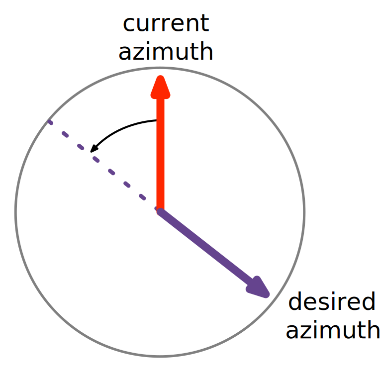

# Swerve Drive Motion{data-background-color="rgb(241, 186, 27)"}

To move the swerve drive, we need to convert the desired motion of the robot \
into positions and speeds of each of the four swerve wheels.

## Swerve Motion

There are three components to swerve drive motion.

- **Forward** and backwards
- **Strafe** left and right
- **Yaw** counter-clockwise and clockwise

\

The red arrows indicate the **speed** and **direction** each wheel is pushing.

We call this the **velocity vector** of the wheel.

## Swerve Motion

These separate components can be combined together to move the robot in any direction.

\

In this example, equal amounts of **forward** and **strafe** input drive the robot at 45° across the field.

## Swerve Motion

All three components can be combined together to produce complex motion.

\

In this example, equal amounts of **forward**, **strafe** and **yaw** input drive the robot across the field while yawing.

## Swerve Yaw Component

When the robot yaws, the wheels are positioned perpendicular to the center of rotation.

Note that this is not 45° if the robot isn't square.

\

We can also yaw around an arbitrary off-center point relative to the robot.

# Swerve Math{data-background-color="rgb(241, 186, 27)"}

In our swerve drive software, we calculate the \
desired position and speed of each wheel.

## Coordinate Frames

We work in two coordinate frames, one local to the robot and one global for the field.

Going forward, we'll also refer to swerve drive motion components (forward, strafe, yaw) as chassis speed (**v~x~**, **v~y~**, and **ω**), with respect to the robot frame of reference.

\

## Wheel Position and Speed

We add together the desired velocity inputs to get a velocity vector for each wheel.

\

## Wheel Speed and Azimuth

Each wheel's **speed** and **azimuth** can be calculated from its velocity vector (**v**~w~).

\

**Azimuth** (θ) is the term we use for the wheels angle relative to the robot frame of reference.

## Normalize Wheel Speeds

Sometimes after calculating wheel velocity vectors, the requested speed may be above the maximum attainable speed for the drive motor on that swerve module.

To fix this issue, we "normalize" all the wheel speeds to make sure that all requested module speeds are below the absolute threshold, while maintaining the ratio of speeds between modules.

\

| Wheel | Calculated Speed | Normalized Speed |
| ----- | ---------------: | ---------------: |
| LF    |            2.414 |              1.0 |
| RF    |            1.732 |            0.717 |
| LR    |            1.732 |            0.717 |
| RR    |            0.414 |            0.172 |

## Optimize Wheel Position

We minimize the change in heading the desired swerve wheel direction would require \
by potentially reversing the direction the wheel spins.

When optimized, the furthest a wheel will ever rotate is 90 degrees.

::: {.columns}
::: {.column width="50%" style="display:inline-flex; flex-direction: column; justify-content: center; height: 766px"}

If the difference between your desired and current azimuth is greater than 90°, rotate the desired azimuth by 180° and reverse the drive motor.

:::
::: {.column width="50%"}
\
:::
:::

## Field Oriented Driving
