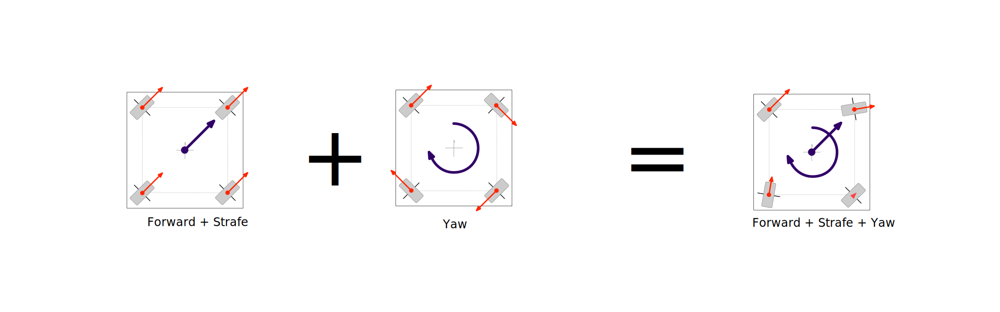
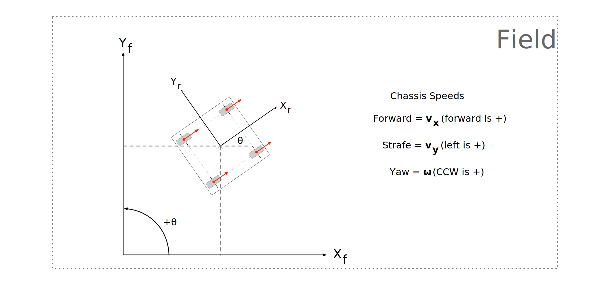

# Swerve Math

## Swerve Motion

There are three components to swerve drive motion.

\

The red arrows indicate the **speed** and **direction** each wheel is pushing.

We call this the **velocity vector** of the wheel.

## Swerve Motion

These separate components can be combined together.

\

In this example, equal amounts of **forward** and **strafe** input drive the robot at 45° across the field.

## Swerve Motion

All three components can be combined together to produce complex motion.

\

In this example, equal amounts of **forward**, **strafe** and **yaw** input drive the robot across the field while yawing.

## Swerve Yaw Component

When the robot yaws, the wheels are positioned perpendicular to the center of rotation.

Note that this is not 45° if the robot isn't square.

\

We call the ratio between the width and height of a rectangle its **aspect ratio**.

## Coordinate Frames

We work in two coordinate frames, one local to the robot and one global for the field.

Going forward, we'll also refer to swerve drive motion components (forward, strafe, yaw) as chassis speed (**v~x~**, **v~y~**, and **ω**), with respect to the robot frame of reference.

\
