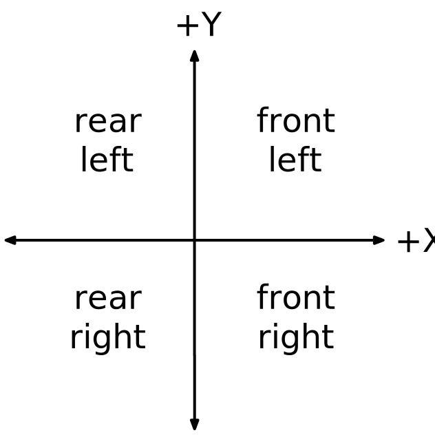
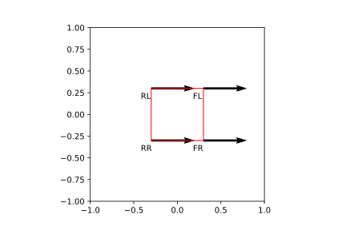
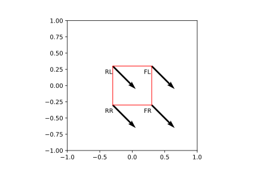
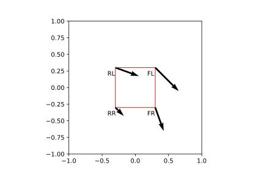

# Swerve Software{data-background-color="rgb(241, 186, 27)"}

In our robot, we use the WPILIB kinematics suite to convert\
desired velocities to swerve module speed and angle.

## Terminology

Kinematics

: The kinematics classes help convert between a universal `ChassisSpeeds` object, containing linear and angular velocities for a robot to usable speeds for each individual module states (speed and angle) for a swerve drive.

Odometry

: Odometry uses sensors on the robot to create an estimate of the position of the robot on the field. In our robots, these sensors are typically drive and azimuth encoders and a gyroscope to measure robot angle.

: The odometry classes utilize the kinematics classes along with periodic inputs about speeds and angles to create an estimate of the robot’s location on the field.

Pose

: A robot's pose is the combination of it's X, Y, and angle (θ) with respect to the field.

## the `ChassisSpeeds` Class

The `ChassisSpeeds` class represents the speeds of a robot chassis.

`vx`
: The velocity of the robot in the **x** (forward) direction.

`vy`
: The velocity of the robot in the **y** (strafe) direction.\
Positive values mean the robot is moving to the left.

`omega`
: The angular velocity of the robot in radians per second.\
Positive is CCW rotation (yaw) of the robot.

```java
double xSpeed = leftJoystick.x * kMaxMetersPerSec;
double ySpeed = leftJoystick.y * kMaxMetersPerSec;
double rotSpeed = rightJoystick.x * kMaxRadiansPerSec;

ChassisSpeeds speeds = new ChassisSpeeds(xSpeed, ySpeed, rotSpeed);
```

Speeds are aligned to a [coordinate system](#coordinate-system) and are given in meters per second.

---

We also use the `ChassisSpeeds` to convert [field-relative](#field-oriented-driving) speeds into robot-relative speeds.

```java
double xSpeed = leftJoystick.x * kMaxMetersPerSec;
double ySpeed = leftJoystick.y * kMaxMetersPerSec;
double rotSpeed = rightJoystick.x * kMaxRadiansPerSec;

ChassisSpeeds speeds = ChassisSpeeds.fromFieldRelativeSpeeds(xSpeed, ySpeed, rotSpeed, gyro.getRotation2d());
```

The angle of the robot is measured by a gyroscope. The robot's angle is considered to be zero when it is facing directly away from our alliance station wall.

## The `SwerveDriveKinematics` Class

The `SwerveDriveKinematics` class is a helper class that converts a chassis velocity (**v**~x~, **v**~y~, and **ω** components) into individual module states (speed and angle).

We initialize an instance of this class by passing in four wheel locations, in meters, relative to the center of the robot.

::: {.columns}
::: {.column width="75%"}

```java
var frontLeft = new Translation2d(0.3, 0.3);
var frontRight = new Translation2d(0.3, -0.3);
var rearLeft = new Translation2d(-0.3, 0.3);
var rearRight = new Translation2d(-0.3, -0.3);

var kinematics = new SwerveDriveKinematics(frontLeft, frontRight, rearLeft, rearRight);
```

:::

::: {.column width="25%"}

{ width=65% }\

:::
:::

---

We then use this `kinematics` instance to perform _inverse kinematics_ to return the module states from a desired chassis velocity.

```java
var speeds = new ChassisSpeeds(xSpeed, ySpeed, rotSpeed);
SwerveModuleState[] states = kinematics.toSwerveModuleStates(speeds);
```

The returned module states are an array of four `SwerveModuleState` objects, each containing the speed and angle of one of the wheels. They are passed back in the same wheel order that we initialized the `SwerveDriveKinematics` in.

\

If you want to specify a [variable center of rotation](#swerve-yaw-component) for the robot, you can pass in a optional `Translation2d` object that is the desired center.

For example, you want to yaw the robot underneath the shooter that is 10 cm left of the centerline of the robot.

```java
var speeds = new ChassisSpeeds(0, 0, rotSpeed);
var center = new Translation2d(0, 0.1);
SwerveModuleState[] states = kinematics.toSwerveModuleStates(speeds, center);
```

---

Sometimes after calculating wheel velocity vectors, the requested speed may be above the maximum attainable speed for the swerve module drive motor and need to be [normalized](#normalize-wheel-speeds).

To fix this issue, `SwerveDriveKinematics` has a `normalizeWheelSpeeds​` static method.

```java
SwerveModuleState[] states = kinematics.toSwerveModuleStates(speeds, center);
SwerveDriveKinematics.normalizeWheelSpeeds(states, kMaxMetersPerSec);
// all state speeds are now less than or equal to kMaxMetersPerSec...
```

We can also use this `kinematics` instance to perform _foward kinematics_ to return the instantaneous chassis velocity from module states.

Typically we would query the hardware encoders to get actual module states, as in this example.

```java
// driveSubsystem has code to read swerve module hardware encoders and converts to module states
SwerveModuleState[] states = driveSubsystem.getModuleStates();

ChassisSpeeds speeds = kinematics.toChassisSpeeds(states);

System.out.printf(
    "robot vxMetersPerSecond = %f, vyMetersPerSecond = %f, omegaRadiansPerSecond = %f %n",
    speeds.vxMetersPerSecond,
    speeds.vyMetersPerSecond,
    speeds.omegaRadiansPerSecond
);
```

## The `SwerveModuleState` Class

The `SwerveModuleState` is a simple data class that represents the speed and direction of a swerve module.

We would typically pass it to our own `SwerveModule` class that knows about our specific hardware.

```java
SwerveModuleState[] states = kinematics.toSwerveModuleStates(speeds, center);
 SwerveDriveKinematics.normalizeWheelSpeeds(states, kMaxMetersPerSec);
frontLeftModule.setDesiredState(states[0]);
// rest of modules...
```

It also performs the [optimization of wheel positioning](#optimize-wheel-position) by minimizing the change in heading the desired swerve wheel direction would require by potentially reversing the direction the wheel spins. For example, our `SwerveModule` class could use it in its `setDesiredState` method.

```java
public void setDesiredState(SwerveModuleState desiredState) {
    SwerveModuleState state = SwerveModuleState.optimize(desiredState, new Rotation2d(azimuth.getEncoderValue()));
    // use optimized state to set module speed and angle...
}
```

## The `SwerveDriveOdometry` Class

Odometry allows us to track our robot's position on the field over a course of a match using readings from swerve drive encoders and swerve azimuth encoders.

We initialize an instance of this class by passing in our initialized `SwerveDriveKinimatics` object, the robot's gyro angle, and optionally a starting robot pose.

```java
var kinematics = new SwerveDriveKinematics(frontLeft, frontRight, rearLeft, rearRight);
var theta = gyro.getRotation2d();

var odometry = new SwerveDriveOdometry(kinematics, theta);
```

Periodically (for example, in `Subsystem.periodic()`), we update the odometry with the current gyro angle and swerve module states.

```java
void periodic() {
    var theta = gyro.getRotation2d();
    SwerveModuleState[] states = getModuleStates();
    odometry.update(theta, states);
}
```

---

We can perform a "hard" reset of the odometry position if we are in possession of a known robot position. For example, perhaps we have just driven the robot into some sort of game feature like a docking port.

```java
Pose2d pose = Constants.DOCKING_POSE;
var gyroAngle = gyro.getRotation2d();
odometry.resetPosition(pose, gyroAngle);
```

By passing in the gyro angle, odometry will compensate for any gyro drift that has occurred up to this point.

\

Finally, we can ask odometry for the robot's calculated field position and angle. This returns the pose of the robot as of the last call to `update()`.

```java
Pose2d pose = odometry.getPoseMeters();
System.out.printf(
    "robot x = %f meters, y = %f meters, theta = %f degrees %n",
    pose.getX(),
    pose.getY(),
    pose.getRotation().getDegrees()
);
```

We can use odometry during the autonomous period for complex tasks like path following. Furthermore, odometry can be used for latency compensation when using computer-vision systems.

## Swerve Kinematics Examples

We can use the Python version of WPILIB kinematics classes in a Jupyter notebook to easily convert desired robot speed and rotation into swerve wheel speeds and angles.

The classes and concepts are identical to the Java version we use on the robot.

```python
# define some useful constants
MAX_SPEED = 1
MAX_ROTATION = 0.5 * math.pi

# set up the swerve drive kinematics class by specifying where the wheels are
# relative to the center of the robot
fl_loc = Translation2d(0.3, 0.3)
fr_loc = Translation2d(0.3, -0.3)
rl_loc = Translation2d(-0.3, 0.3)
rr_loc = Translation2d(-0.3, -0.3)

kinematics = SwerveDrive4Kinematics(fl_loc, fr_loc, rl_loc, rr_loc)
```

---

### Drive in forward direction

```python
speeds = ChassisSpeeds(MAX_SPEED, 0, 0)
module_states = kinematics.toSwerveModuleStates(speeds)
module_states = kinematics.normalizeWheelSpeeds(module_states, MAX_SPEED)
plot_swerve(wheel_locs, module_states)
```

{width=60%}\

---

### Drive in forward, right directions

```python
speeds = ChassisSpeeds(MAX_SPEED, -MAX_SPEED, 0)
module_states = kinematics.toSwerveModuleStates(speeds)
module_states = kinematics.normalizeWheelSpeeds(module_states, MAX_SPEED)
plot_swerve(wheel_locs, module_states)
```

{width=60%}\

---

### Drive in forward, right and clockwise directions

```python
speeds = ChassisSpeeds(MAX_SPEED, -MAX_SPEED, -MAX_ROTATION)
module_states = kinematics.toSwerveModuleStates(speeds)
module_states = kinematics.normalizeWheelSpeeds(module_states, MAX_SPEED)
plot_swerve(wheel_locs, module_states)
```

{width=60%}\
